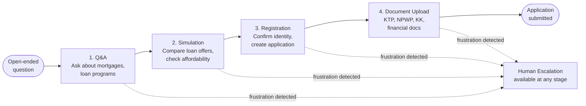

# AI Mortgage Advisory Chat

**Company/Client:** Pillar Lab

**Category:** Customer Experience

**Role:** Sole Product Designer

**Duration:** ~4.5 months (1 month design & PRD, 2–3 weeks detailing edge cases, 3 months development)

**Team:** PM, engineers, copywriter, data analyst

## Hero Carousel

1. **Chat, comparison & simulator** — Quick-reply prompts, a side-by-side loan offer comparison, and the Loan Simulator panel with adjustable tenure and APR.
    
    
    
2. **Personalized quick-reply prompts** — Prompts adapt to who's asking — most-asked questions for a new visitor, a pinned resume-progress card for someone mid-application.
    
    
    
3. **In-chat data collection** — Structured step cards collect the inputs a real calculation needs, without pulling the user out of the conversation.
    
    
    
4. **Transparent loan breakdown** — Full APR structure across the loan term, fees and charges, and program benefits shown per bank offer — not just a headline rate.
    
    
    
5. **Real-time affordability check** — Feasibility feedback tied to the user's own financial profile, flagging comfortable versus limited-room scenarios before they commit.
    
    
    
6. **In-chat KYC & document upload** — ID card capture and data extraction handled directly in the chat, with a confirmation step before the data is submitted.
    
    
    

## Setup

Pillar needed to close two problems at once: an immediate ops cost problem, and a structural one that determined whether this could ever be more than a Ringkas-only tool.

The ops case, pulled directly from product intake data:

- **~125 inquiries/day reaching human agents** — splitting into ~40/day repetitive advisory questions (product info, registration, application process, document upload, Akad) and ~85/day pure wrong-product deflection (customers asking about KTA, P2P, insurance — products Ringkas doesn't even sell).
- **~55 agent-hours/week, roughly 1.3 FTE** — spent on volume that had either already been answered before or should never have reached a human at all.
- **A third, quieter loss:** customers who reached "register to continue" in chat and didn't complete registration in the separate Consumer WebApp — a drop-off built into the handoff itself, not just an agent-hours problem.

Underneath the numbers sits a structural ceiling no amount of agent training fixes: human advisory quality is gated by whichever agent happens to pick up, that ceiling doesn't move, and it can't personalize past a generic pitch at scale — while an AI conversation's baseline keeps improving with every iteration instead of plateauing.

The two problems compound, not stack: solving the cost problem *and* the single-tenant lock-in in one build is what let Pillar turn this into a white-label product — a partner bank can now deploy this exact chat under their own brand instead of Ringkas building a bespoke one per bank.

This wasn't a simple deflection bot, either — it had to hold an actual financial conversation, in a market with no existing playbook for what trustworthy AI mortgage advice should sound like.

## Challenge

### No existing mental model

Almost no one in Indonesia had experienced mortgage advice inside a chat before — no competitor to benchmark, no prior project to inherit patterns from, and no cultural default for what trustworthy AI financial advice should sound like. Every interaction pattern — how much to ask, how to phrase a recommendation, when to sound human versus official — had to be originated, not adapted. Getting it wrong wouldn't just feel awkward; it would undermine the whole conversation's trust.

### Completeness vs. comprehension

Legal completeness pushes toward showing everything; usability pushes toward showing only what's actionable. Holding that line against a more technical-leaning PM meant defending it on progressive disclosure — an established principle, just not one validated by research specific to this call.

### A genuinely new interaction shape

This wasn't a pure chat interface or a pure functional tool — it had to be both, letting customers converse naturally while completing tasks (uploading documents, adjusting a repayment slider, confirming a simulation) without fracturing into "now you're chatting" versus "now you're filling a form." That meant deciding, case by case, when a functional element should surface versus stay conversational — judgment with no established playbook, since chat-plus-functional-UI is still new territory even outside Indonesia.

## Persona

Rather than a spread of buyer types, design was deliberately narrowed to one segment: **first-time buyers**. General buyer segmentation research (income band, life stage, risk tolerance, first-time vs. repeat) exists and could support more personas later — but building multiple buyer types before validating the chat's core interaction pattern with even one would have front-loaded complexity the project didn't have runway for. First-time buyers were the sharper starting point: the least mortgage-literate group, facing the steepest jargon curve, with the most to gain from a chat that demystifies the process instead of assuming prior experience.

**First-time buyer** — Mortgage webchat persona

- Age range: Mid-20s–mid-30s
- Occupation: Salaried, stable income
- Tech comfort: Hesitant, prefers human contact
- Motivation: A life event (marriage, new baby)
- Key trait: Time-poor — limited availability for research, documents, or unclear waiting

### Goals

- Secure a home in time for the life event, without financial strain
- Get a realistic affordability picture before getting attached to a house
- Minimal disruption to a full work schedule

### Frustrations

- Financial and legal jargon makes the process feel opaque
- Chat-only interaction feels too risky for high-stakes decisions
- No visibility into status during long waits
- Document requirements feel like a moving target

### Needs

- Plain-language explanations of costs, terms, and requirements
- Transparent, self-serve status tracking
- A clear path to a human for high-stakes decisions
- A process that respects limited time

### Empathy Map — the journey from low intent to applying

**Phase 1 scope:** the shipped chat covers steps 1–6 below (Looking for house through Applying). Steps 7–10 — submitting additional docs, status tracking, notary, and Akad — stay manual and downstream for this phase (see User Flow).

| Step | Do | Think | Feel | Unmet Needs |
| --- | --- | --- | --- | --- |
| Looking for house | Browses listings casually, without a fixed budget | "Can I actually afford this?" | Hopeful, motivated — but untethered | A grounded sense of real borrowing capacity before house hunting |
| Installment and initial fee | Searches for DP and installment info across banks | "What does this mean for my finances?" | Sticker shock; confused by tenor, fixed vs. floating | Clear, personalized numbers instead of generic bank rates |
| Finding out requirements | Checks document and eligibility lists; may self-check SLIK | "Do I even qualify?" | Anxious about credit history, even if overblown | Reassurance on eligibility before investing more emotion |
| Comparing loan programs | Compares banks and programs manually, likely alone | "Which one is actually right for me?" | Overwhelmed by jargon; wants guidance, not just options | Human-guided comparison of trade-offs, not raw options |
| Pooling documents | Gathers KTP, NPWP, salary slips, bank statements from multiple sources | "Do I have everything they need?" | Fatigue and frustration | A clear, fixed checklist that doesn't shift |
| Applying | Submits the application and waits | "It's out of my hands now" | Relief mixed with lingering anxiety | Visibility into what's happening during the wait |
| Submit other docs | Provides additional requested documents | "Why do they need more? I thought I was done" | Frustrated — feels like a moving target | Clear reasoning for why more documents are needed |
| Tracking application status | Checks in by calling or visiting the bank for updates | "Is it approved yet?" | Anxious uncertainty | Self-serve, real-time status without needing to ask |
| Meet with notary | Reviews and signs legal documents with the notary | "I don't fully understand what I'm signing" | Out of their depth | A human to walk through the legal paperwork |
| Akad day | Signs the final credit agreement in person | "This is really happening" | Relief and excitement, with last-minute nerves | Confirmation everything is in order before the big moment |

## Research Synthesis

With no digital product to study, I used the human channel as the closest proxy: interviewing customers who'd been through the manual version of this exact conversation — talking to a bank's own conversion staff — to reverse-engineer the flow and where people hesitated or dropped off. That became the insight base the mental model was built from.

To pressure-test what interviews alone couldn't confirm, I checked published research and applied general UX principles where research didn't exist:

| Finding | Why it matters | Design response |
| --- | --- | --- |
| A fixed, unambiguous checklist isn't just UX polish — it's rejection prevention. | Missing or unclear document requirements are one of the most common places a KYC flow loses people — vague formats (like "proof of address" with no guidance) force re-uploads, and every re-upload is a fresh chance to lose the customer. | The checklist shows accepted formats with a good-vs-bad example, not a generic rejection message. |
| NPWP gets validated in Phase 1, not buried later. | NPWP is a [mandatory requirement with no exceptions at any Indonesian bank](https://mirailand.id/en/blog/checklist-dokumen-kpr-lengkap), used to verify tax and income validity — missing or invalid NPWP stalls applications at initial verification. | It's checked early, before further effort into Phase 2. |
| Human-in-the-loop isn't a fallback — it's a deliberate backstop. | Complex, multi-document processes lose people fastest at the moments they're most uncertain — a visible human option changes what happens at that moment. | Escalation is a standing option at every step, framed as a designed path, not a patched-over gap. |
| The interaction model borrows familiarity from WhatsApp, deliberately. | WhatsApp is the messaging app most Indonesians already use daily, for everything from casual chat to customer service — building the flow to read the same way lowers the guard most people bring to anything that looks like a form. | The flow reads as a chat thread doing form-level work, not a form pretending to be a chat. |

## User Flow

The end-to-end journey moves through four stages — from an open-ended question to a submitted application. This is deliberately scoped to the pre-application funnel for this phase; document review, notary, and Akad signing stay manual and downstream.

Escalation isn't tied to a specific stage — the AI surfaces a human option whenever it detects frustration signals from the customer, wherever they are in the flow, answering the persona's stated need for "a clear path to a human for high-stakes decisions." Document Upload is called out specifically below because it was the one point designed pre-launch on the assumption that Indonesian users would need a human backstop most when handling identity documents — and post-launch behavior confirmed it.

1. **Q&A**
    - Customer does: Asks general questions about mortgages, loan programs, or their own financial situation.
    - Chat does: Answers conversationally and surfaces quick-reply prompts — personalized to whether the customer is new or has an application in progress — to guide toward a specific goal.
2. **Simulation**
    - Customer does: Provides property price, type, income, and preferred tenor; compares loan offers side by side.
    - Chat does: Runs the affordability check and loan comparison in real time, showing full APR structure and fees per bank offer.
3. **Registration**
    - Customer does: Confirms identity basics to move from general advisory into a tracked application.
    - Chat does: Creates the application record and transitions the customer into the document-collection stage.
4. **Document Upload**
    - Customer does: Uploads KTP, NPWP, KK, and supporting financial documents against a fixed checklist.
    - Chat does: Validates each document on submission, flags issues inline (wrong format, expired ID, incomplete statement), and surfaces human escalation on detected frustration — the point this mattered most, and where post-launch behavior confirmed the human backstop was doing its job.

## Design Exploration

Each of the four key moments in the flow went through three directions before landing on what shipped. Below is the shipped direction for each, with what got ruled out and why.

### Cold Start — Option A, guided quick-reply menu

Shipped over a step-by-step onboarding sequence and a jump-straight-to-input version. A frames four common intents (check affordability, compare programs, continue an application, talk to a human) as tappable options instead of an open text field — the direct interface expression of the persona's need for plain-language framing, and consistent with the personalized quick-reply pattern already promised in the Hero Carousel.

### Affordability Calculator — Option A, live slider with instant estimate

Shipped over a multi-turn Q&A collecting the same two numbers, and a static form. A resolves the number fastest — no back-and-forth, nothing filled in blind — and keeps the chat behaving like a calculator instead of making the customer wait on a reply after every input.

### Loan Program Comparison — Option B, side-by-side table, essential by default

This is where the "holding the line on customer language" decision actually plays out: when the PM pushed for showing complete loan program information up front, I argued for leading with numbers a non-expert can act on — rate, monthly estimate, down payment — across all three programs at once, with "Show complete details for all" as an opt-in expansion. It beat a single-card swipe view because side-by-side comparison is the actual task here; making someone swipe and hold numbers in memory to compare three offers works against the moment's goal.

### Document Upload — Option B, suggested phases, nothing locked

Documents are grouped into three suggested phases (identity, income, additional) instead of one flat list of six — but every phase stays open and tappable at any time; the order is a suggestion, not a gate. This mattered because Research Synthesis already commits to "a fixed, unambiguous checklist that doesn't shift" — a version that locked later phases until earlier ones were done would have reintroduced the moving-target feeling the checklist was designed to prevent.

## Success Metrics

**Primary metric — Transactions created via RISA-NXT per day.** Defined as unique customer sessions that complete the full pre-application funnel (cold start → registration → transaction-level consent → KTP upload).

- Baseline: 119 trx/day today across all channels (~109 via the Consumer WebApp — the volume this chat is meant to shift)
- Target: ≥30 trx/day within 3 months of launch; ≥60 trx/day (~55% of the WebApp baseline) within 6 months

**Secondary metrics**

| Metric | Target |
| --- | --- |
| Funnel completion rate | ≥30% within 3 months |
| Repetitive Ops inquiry reduction | ↓40% within 2 months of launch |
| Simulation → application conversion | ≥12% |

## Result

The chat is live and handling real conversations, but it's too early post-launch to report against any of the targets above — need at least one full measurement window before trx/day and funnel completion numbers mean anything.

One signal is already in: the Document Upload escalation backstop (see User Flow) is performing as designed post-launch.

## Lesson Learned

*Reflection 1:* Looking back, the one thing I'd push harder for is text formatting in longer AI responses. Financial product information is dense by nature, and an unformatted wall of text is heavy to read when the topic is someone's mortgage — that's a fight worth having earlier next time.

*Reflection 2:* I should've pushed harder for usability testing on the genuinely new patterns. Chat-plus-functional-UI switching, frustration-triggered escalation, phased document collection — none of these had an existing playbook to validate against, in Indonesia or anywhere else. Next time I'd push harder for even lightweight usability testing specifically on the novel parts of the flow, rather than relying on judgment alone where there was the least precedent to fall back on.