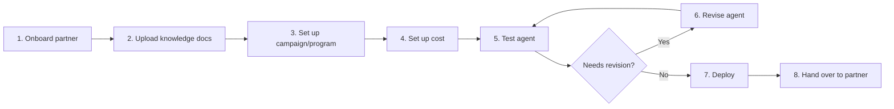

# Console for Managing Bank Partners & Configuring Their AI Agents

**Company/Client:** Pillar Lab

**Category:** Platform Tools

**Built from:** Existing tool

## Setup ✅ Reviewed

Pillar wanted to turn years of accumulated mortgage domain knowledge and data into something the business could act on directly — LLM-powered AI agents that convert cold leads into warm ones for bank partners. Portal is the tool that makes that possible on the inside: where Pillar's internal team configures, tunes, and monitors those agents per partner, rather than the customer-facing product the agents produce.

Giving Engineering, PM, Growth, and Ops teams that control meant a console to onboard bank partners, configure agent behavior per partner, and monitor how leads were being qualified. But the earlier tool — with far more limited features — hadn't kept pace: as more partners came on, complexity grew unevenly, and the system stopped teaching people what each setting actually did as they used it. People guessed their way through configuration that directly affected which leads got contacted and how.

## Challenge ✅ Reviewed

### Cognitive load, not a missing feature

The earlier tool wasn't self-explanatory, had weak information architecture, and didn't teach users what each feature did as they encountered it. People guessed their way through configuration — costing real onboarding time for new hires and slowing down how fast a new bank partner's AI agent could be set up.

### Technical, AI-specific territory for non-technical users

Configuring an AI agent is inherently technical, but Portal's actual users — PM, Growth, and Ops — often aren't. Jargon they didn't recognize, in a domain they hadn't worked in before, made an already-unfamiliar task feel more nerve-wracking than it needed to be — especially since misconfiguring an agent has a live consequence on a real partner relationship, not just a UI mistake to undo.

### Complex features, complex interactions

Beyond navigation, individual features weren't simple form-fills — several involved multi-step, branching configuration flows. The challenge wasn't only organizing where things lived, it was making genuinely complex interactions feel manageable to someone doing this for the first time.

## Persona ✅ Reviewed

Portal's internal audience isn't one uniform user — four roles use it differently, with different technical comfort and different stakes if something goes wrong.

| Role | Technical comfort | Primary task in Portal | Main risk if they get it wrong |
| --- | --- | --- | --- |
| Engineering | High | Configures and maintains the underlying agent logic and integrations | A technical misconfiguration breaks agent behavior across multiple partners at once |
| PM | Low–moderate | Reviews agent performance and coordinates priorities across partners | Misreading a partner's setup leads to misaligned priorities or a delayed launch |
| Growth Manager | Low | Tunes agent conversation and conversion behavior per partner | A poorly tuned agent turns off leads or misrepresents a partner's brand voice |
| Ops Manager | Low | Onboards new bank partners and monitors day-to-day account health | An onboarding error ships a partner's agent live with the wrong settings |

### Goals

- Get a new bank partner's agent live correctly, without routing every routine setup through engineering
- Understand what a setting does before changing it, especially when it touches a live partner
- Move through configuration confidently instead of guessing

### Needs

- In-context explanation of what a setting does before committing to a change
- A clear signal for what's low-risk to touch versus what affects a live partner
- A shared pattern across features, so learning one part of Portal transfers to the next

## Research Synthesis ✅ Reviewed

No formal research round happened for Portal — the problem was identified directly from internal usage and complaints. To ground the redesign, I checked it against established UX practice rather than running new research:

### Jargon comprehension is relative, not absolute

[Nielsen Norman Group's guidance on technical jargon](https://www.nngroup.com/articles/technical-jargon/) notes that a term can be completely clear to one audience and unintelligible to another — the same word carries different comprehension levels depending on who's reading it. That's exactly the gap between Engineering and the PM/Growth/Ops teams using Portal, and it's why explanations needed to live in the interface itself rather than assume shared vocabulary.

### Progressive disclosure is the established response to this kind of complexity

Hiding advanced options until they're needed is a long-standing UX pattern for preventing cognitive overload in complex tools. It's why the redesign leaned on layering settings by relation, usage frequency, and sensitivity instead of surfacing everything at once.

### Structuring around how people think, not how the system is built

[NN/G's information architecture guidance](https://www.nngroup.com/articles/ia-study-guide/) points to matching structure to users' own mental models — via methods like card sorting — rather than organizing by internal system logic. That's the same instinct behind grouping Portal's settings by relation, usage frequency, and sensitivity rather than by how the underlying system happened to be built.

## User Flow ✅ Reviewed

Getting a new bank partner live moves through eight steps, with a test-and-revise loop before anything ships.

1. **Onboard partner** — Register the new bank partner in Portal.
2. **Upload knowledge docs** — Feed the partner's product/lending info into the agent's knowledge base.
3. **Set up campaign/program** — Configure which loan programs and campaigns the agent should represent.
4. **Set up cost** — Configure pricing/cost parameters tied to the partner's programs.
5. **Test agent** — Validate the agent's behavior before it's live.
6. **Revise agent** — Adjust configuration based on test results; loops back to step 5.
7. **Deploy** — Once testing passes, the agent goes live.
8. **Hand over to partner** — Partner takes over day-to-day use of their live agent.

## Design Exploration ✅ Reviewed

The restructure started with understanding the system before touching the interface, layering three lenses over every menu and feature:

- **Relation.** How every menu and feature actually related to each other.
- **Usage frequency.** What teams touch constantly versus rarely.
- **Sensitivity.** What handles risk-bearing data versus what doesn't.

That three-part lens turned a pile of features into an information architecture with real logic. To make that IA hold as a shared language, I led the creation of design principles with my team here on Portal — a framework that originated in this project and was later adopted beyond Portal, into Pillar as a whole.

## High Fidelity ✅ Reviewed

*No screenshots of the final Portal UI included yet — add screens here when available.*

### Decision — educating, not just labeling

Hover tooltips, information banners, and an "ask AI" entry point built directly into the interface, so a non-tech-savvy user encountering unfamiliar jargon isn't stuck guessing — an answer is one click away, in the moment it's needed.

To hold consistency at this scale, I built master pages and screen patterns in Figma as the benchmark, then generated the rest of the system's pages with Claude Design based on each page's function — though the patterns weren't fully locked down before generation started, so keeping everything consistent meant a cleanup pass afterward. Even with that, it's what made fast stakeholder collaboration and revision cycles possible on a system this large.

## Result ✅ Reviewed

No formal metrics yet, but informal feedback from PM, Growth, and Ops points to two concrete wins: onboarding new team members onto Portal takes noticeably less time than before, and — for the first time — teams can measure agent chat quality directly in the tool, instead of relying on guesswork or manual spot-checks.

## Lesson Learned ✅ Reviewed

*Reflection:* If I started Portal over, I'd invest more upfront in UI patterns and master pages before generating pages with AI — it would have kept the AI-assisted ("vibe coded") output more consistent and under control from the start, rather than tightening it up after the fact.