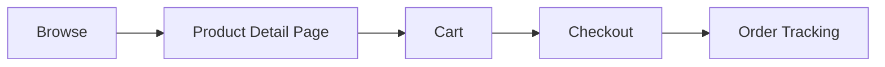

# Fashion Brand E-Commerce Website

**Company/Client:** Siena Made

**Category:** Customer Experience

**Type:** Direct client engagement

**Status:** In development

## Setup ✅ Reviewed

The client sold through Shopee as their existing channel and had no standalone website — this project was to build one that runs alongside Shopee, not replace it. Three concerns were front-of-mind: keep it simple so customers focus on shopping, don't lose the traffic advantage Shopee already gave them, and let customers trust the process enough to actually buy on a site they'd never used before.

## Challenge

### Shopee wins on friction, not loyalty

Existing accounts, fewer clicks, constant promos. A new standalone site loses by default unless it's designed around that gap.

### No CMS — everything hardcoded

Product info, pricing, and copy are all hardcoded directly into the build. Any update needs a developer, not something the client can do herself.

## Persona ✅ Reviewed

No formal persona was built for this solo freelance engagement — the client herself was the primary source of audience insight — but the target customer can be characterized as:

- Female, early 20s to early 30s
- Middle-to-upper socioeconomic class
- Sophisticated, productive lifestyle
- Girly aesthetic preference
- Cherishes — even romanticizes — the unwind ritual before sleep

Siena Made sells loungewear and sleepwear, so that last trait isn't incidental — it's directly tied to the product category.

## Research Synthesis ✅ Reviewed

Benchmarking was done using references the client provided, plus independent research of my own — informing the strategy below rather than a separate synthesis exercise.

## User Flow ✅ Reviewed

The shopping journey moves through five steps, from first browse to post-purchase tracking.

1. **Browse** — Customer explores the catalog.
2. **Product Detail Page** — Views product details, pricing, and imagery.
3. **Cart** — Reviews selected items before purchase.
4. **Checkout** — Completes payment and order details.
5. **Order Tracking** — Receives proactive WhatsApp updates on status changes instead of needing to check a tracking page (see Design Exploration).

## Design Exploration ✅ Reviewed

The response was a full checkout-and-incentive strategy, not just a homepage:

- **Remove friction** — reframing order tracking into proactive updates instead of a page customers have to remember to check (detailed below)
- **Beat Shopee on value, not convenience** — checkout without requiring sign-in, plus a discount for first-time orders
- **Fast, responsive CS** — a sticky button for direct, immediate access to customer service

### Decision — order tracking, reframed as trust

Rather than a passive tracking page customers have to remember to check, the solution pushes proactive WhatsApp notifications on meaningful status changes — ordered, on the way, arrived — so the customer never has to go looking. The point was making them feel taken care of, not just informed.

## High Fidelity ✅ Reviewed

*Screenshots from the live site ([siena-made-website.vercel.app](http://siena-made-website.vercel.app)) go here — home, PDP, cart drawer.*

Built a design token system and full design system for the site from a client-provided reference. Delivered a first-draft prototype (home, PDP, cart drawer) for review. This was a smaller-scope engagement, so the role leaned advisory — setting direction across pages, flows, and features that the client then greenlit, rather than defending decisions against pushback.

## Result ✅ Reviewed

*Still in development — add launch metrics or client feedback here once available.*

## Lesson Learned

*Nothing specific captured yet — the brief was straightforward with no major disagreements or surprises. Add one here if it comes to mind.*